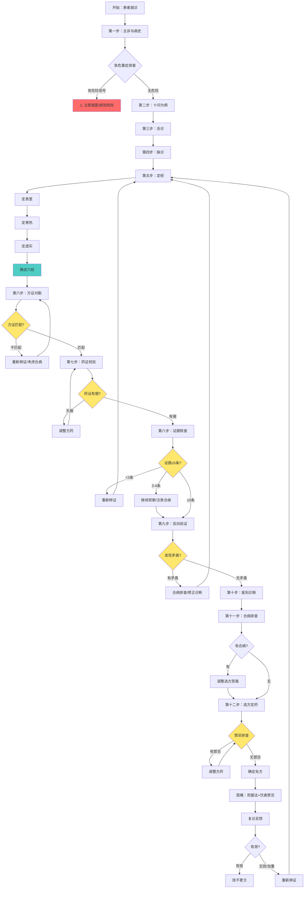
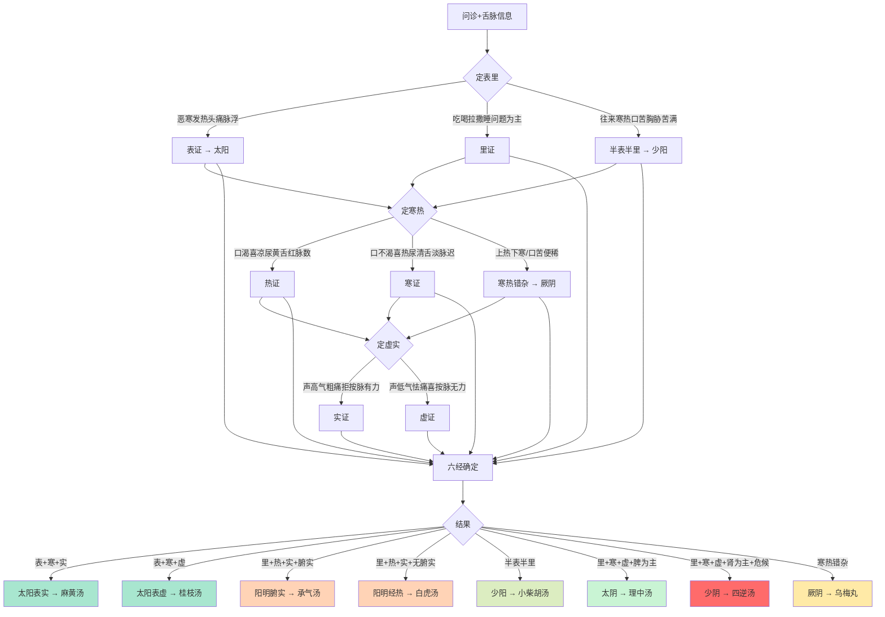
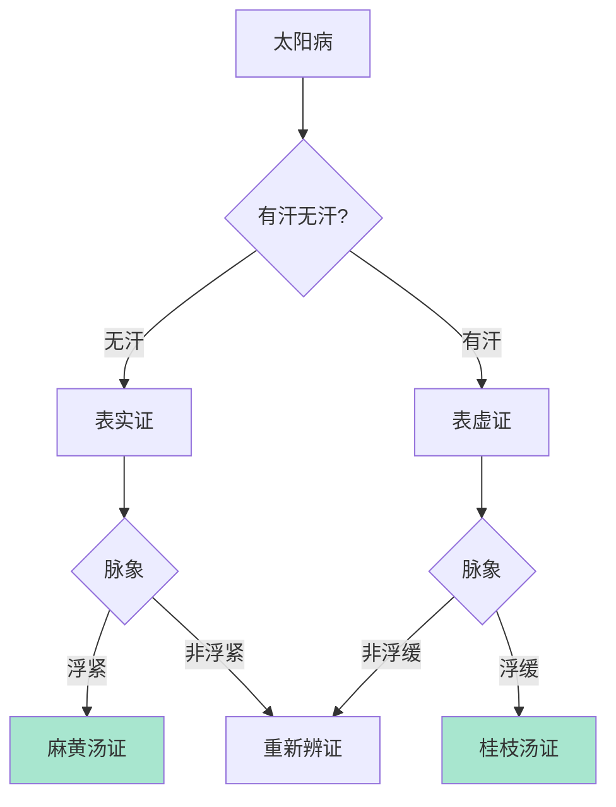
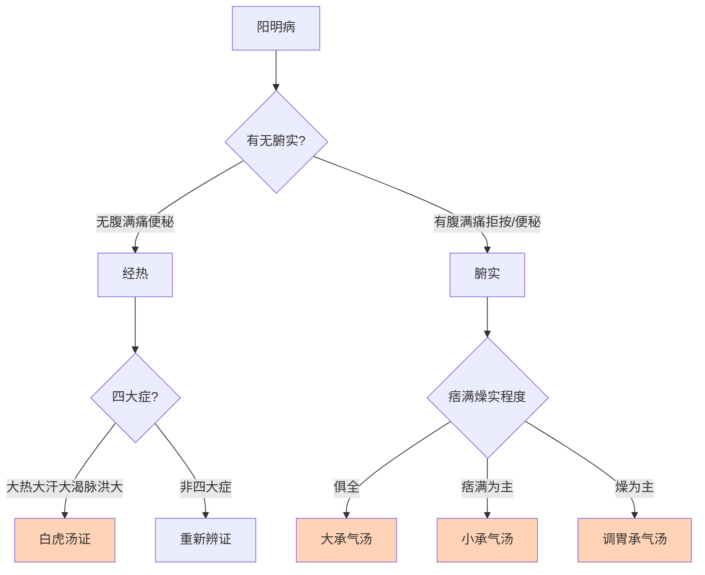
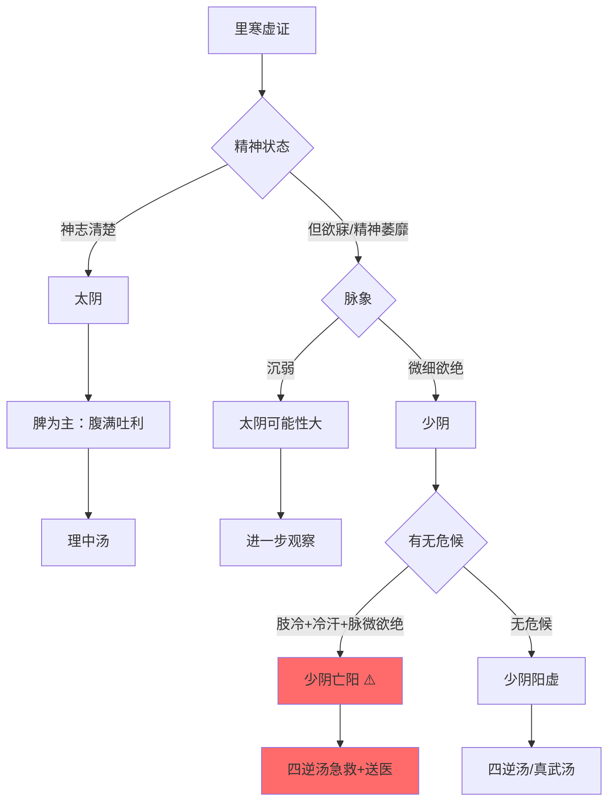
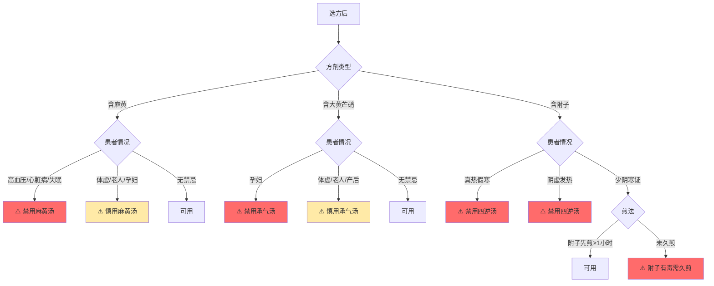
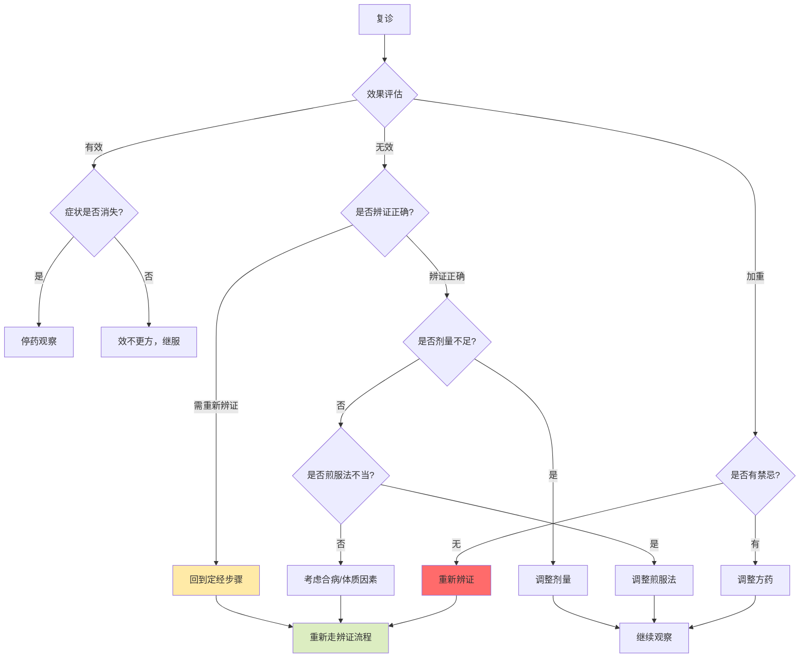

# 中医六经辨证流程图

> 本流程图展示辨证全流程及关键决策点。

---

## 一、完整辨证流程图



---

## 二、定经决策图



---

## 三、太阳病鉴别流程



---

## 四、阳明病鉴别流程



---

## 五、太阴vs少阴鉴别流程



---

## 六、禁忌排查流程



---

## 七、复诊反馈流程



---

## 使用说明

1. 本流程图使用 Mermaid 语法，可在支持 Mermaid 的 Markdown 编辑器中渲染
2. 绿色节点表示正常流程
3. 黄色节点表示决策点
4. 红色节点表示需要特别注意的危险信号或禁忌

---

## ASCII 备用版本

如无法渲染 Mermaid，可参考以下 ASCII 流程图：

```
                    ┌─────────────┐
                    │  开始就诊    │
                    └──────┬──────┘
                           │
                    ┌──────▼──────┐
                    │ 主诉与病史   │
                    └──────┬──────┘
                           │
                    ┌──────▼──────┐
                    │ 急危重症排查 │
                    └──────┬──────┘
                           │
              ┌────────────┼────────────┐
              │                         │
        ┌─────▼─────┐             ┌─────▼─────┐
        │ 有危险信号 │             │  无危险   │
        └─────┬─────┘             └─────┬─────┘
              │                         │
        ┌─────▼─────┐             ┌─────▼─────┐
        │ ⚠️立即就医 │             │ 十问为纲  │
        └───────────┘             └─────┬─────┘
                                        │
                                 ┌──────▼──────┐
                                 │  舌诊+脉诊  │
                                 └──────┬──────┘
                                        │
                                 ┌──────▼──────┐
                                 │    定经     │
                                 │ 表里寒热虚实│
                                 └──────┬──────┘
                                        │
                                 ┌──────▼──────┐
                                 │  方证对勘   │
                                 └──────┬──────┘
                                        │
                              ┌─────────┼─────────┐
                              │                   │
                        ┌─────▼─────┐       ┌─────▼─────┐
                        │  方证匹配  │       │ 方证不匹配 │
                        └─────┬─────┘       └─────┬─────┘
                              │                   │
                        ┌─────▼─────┐       ┌─────▼─────┐
                        │  药证校验  │       │ 重新辨证  │
                        └─────┬─────┘       └───────────┘
                              │
                        ┌─────▼─────┐
                        │  证据核查  │
                        └─────┬─────┘
                              │
                        ┌─────▼─────┐
                        │  反向验证  │
                        └─────┬─────┘
                              │
                        ┌─────▼─────┐
                        │  鉴别诊断  │
                        └─────┬─────┘
                              │
                        ┌─────▼─────┐
                        │ 合病排查  │
                        └─────┬─────┘
                              │
                        ┌─────▼─────┐
                        │  选方定药  │
                        └─────┬─────┘
                              │
                        ┌─────▼─────┐
                        │  禁忌排查  │
                        └─────┬─────┘
                              │
                              ├──有禁忌──→ 调整方药
                              │
                        ┌─────▼─────┐
                        │  确定处方  │
                        └───────────┘
```